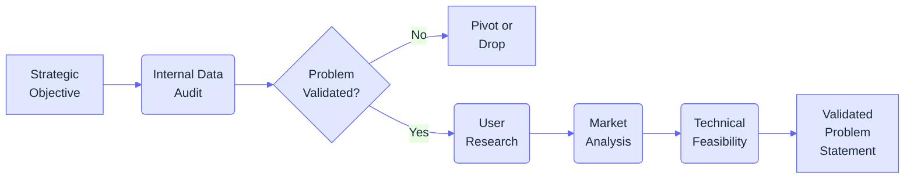
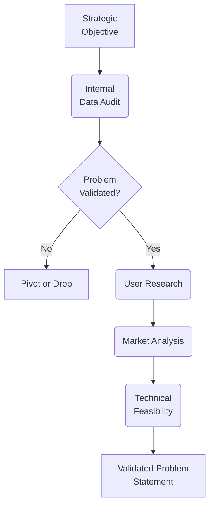

# Module 2: Discovery

## 2.1 Entrance Criteria

:::present
- **Strategic Objective**: Align on "What success looks like" (growth, churn, or efficiency).
- **Stakeholder Buy-in**: Ensure Design and Data resources are locked—not just "aware."
- **Baseline Metrics**: Establish current benchmarks to measure future impact.
> [!TIP] **The Hypothesis First Rule:** Never go into Discovery blind. Write a "Problem Hypothesis" first: *We believe [User Segment] struggles with [Task] because of [Reason].*
:::

Before initiating the Discovery phase, the following must be present:

* **Strategic Objective**: A clear directive from leadership OR a PM-led identification of a business need/opportunity.
* **Stakeholder Buy-in**: Confirmation that resources (PM, Design, Data) are allocated.
* **Baseline Metrics**: Initial access to current performance data or high-level business goals.

## 2.2 Lead Roles & Squad

:::present
- **Primary Driver**: **Product Manager** (The "What" and the "Why").
- **Design Lead**: Translates pain points into potential journey maps.
- **Engineering Lead**: Assesses feasibility early to prevent "Dreaming in a Vacuum."
- **Data Analyst**: Provides the quantitative "Truth" behind user behavior.
> [!TIP] **The SME Shortcut:** Invite Subject Matter Experts (Sales/Support) to your kick-off—they represent the "Front Line" and know the common complaints by heart.
:::

* **Primary Driver**: Product Manager (PM).
* **Support Squad**: Product Designer / UX Researcher, Data Analyst, Engineering Lead, and Subject Matter Experts (SMEs).

> [!NOTE]
> The Engineering Lead is critical in Discovery to flag "technical impossibilities" early, preventing wasted design effort.

## 2.3 Discovery Flow

:::present

:::

Understanding the sequence of validation:

## 2.4 Internal Data & Problem Definition

:::present
- **Data Aggregation**: Spot friction points where users "bounce" or hesitate.
- **Voice of Customer (VoC)**: Mine Support tickets and reviews for raw recurring themes.
- **Stakeholder Alignment**: Map institutional knowledge and business constraints.
> [!TIP] **Find the "Gravity":** Use heatmaps to find where users click vs. where you *think* they should click. Data usually reveals a different reality than intuition.
:::

Gather and synthesize existing internal information to define the "Opportunity Gap."

* **Data Aggregation**: Pull performance data to identify friction points or usage drops.
* **Voice of Customer (VoC)**: Review customer service logs, public reviews, and direct feedback.
* **Stakeholder Interviews**: Align on business constraints and surface institutional knowledge.

> [!IMPORTANT]
> Don't just look at *what* is happening (Data); look at *where* it's happening to narrow down the research scope.

## 2.5 User Research Methodologies

:::present
| Methodology | Essence | Best Use Case |
| :--- | :--- | :--- |
| **Interviews** | *The Why* | Deep motivation & emotional friction. |
| **Surveys** | *The Volume* | Quantifying broad scale of a problem. |
| **Analytics** | *The Truth* | Seeing what they actually DO, not say. |
| **Focus Groups** | *The Group* | Seeing peer influence & conflicting needs. |

> [!TIP] **Triangulate or Fail:** A singular data source is a risk. Only trust an insight if you see it in **both** the quantitative data (Analytics) and qualitative feedback (Interviews).
:::

Deep-dive into user behaviors to validate the "Why" behind the data.

| Methodology       | Primary Indicator    | Best Use Case                                      |
| ----------------- | -------------------- | -------------------------------------------------- |
| 1-on-1 Interviews | Qualitative Insights | Identifying hidden pain points and motivations.    |
| Surveys           | NPS / CSAT           | Gathering quantitative evidence from a large base. |
| Focus Groups      | Feature Desirability | Observing peer interactions and conflicting needs. |
| Funnel Analytics  | Drop-off Rates       | Measuring exactly where users abandon a journey.   |

> [!NOTE]
> **Triangulation** is key: Match what users *say* (Interviews) with what they *do* (Analytics).

## 2.6 Running User Research

:::present
1. **Hypothesis Mapping**: Map what you *think* you know vs. what you need to prove.
2. **Unbiased Recruitment**: Don't just talk to "Happy Users"—find the churned ones.
3. **Affinity Mapping**: Group observations into "Pain Themes" to find the biggest lever.
> [!WARNING] **The Echo Chamber:** Avoid leading questions like "How much do you like this?" Instead, use: *"Walk me through the last time you tried to..."*
:::

A structured approach to gathering insights:

1. **Define Research Questions**: What specific assumptions need validation?
2. **Participant Recruitment**: Screen real users representing target personas.
3. **Synthesis & Analysis**: Use affinity mapping to categorize raw data into themes.

> [!WARNING]
> Avoid "Confirmation Bias." Don't ask leading questions like "How much do you like this feature?" Instead, ask "Tell me about the last time you tried to..."

## 2.7 Market & Competitor Research

:::present
- **SWOT Analysis**: Map where competitors are slow, expensive, or complex.
- **Market Sizing**: Is the "Opportunity Gap" big enough to justify the build?
- **Regulatory Check**: Identify "Red Tape" early (GDPR, Compliance, Legal).
> [!TIP] **The "Blue Ocean" Move:** Look for "Workarounds." If customers are using Excel to solve something your app should do, that is a massive opportunity for a native feature.
:::

Assess the external environment to identify benchmarks and market risks.

* **Competitor Analysis**: SWOT analysis on direct and indirect competitors.
* **Market Trends**: TAM/SAM/SOM calculations and growth trends.
* **Regulatory Check**: Documentation of barriers and compliance requirements.

> [!TIP]
> Look for "Blue Ocean" opportunities—areas where competitors are weak or customer satisfaction is universally low.

## 2.8 Technical Discovery (Feasibility)

:::present
- **Architectural Fit**: Does this break our core data model?
- **Integration Readiness**: Do we have the APIs needed, or do we build them?
- **Risk Assessment**: Identify high-complexity "Rabbit Holes" before they start.
> [!TIP] **The "Buy vs. Build" Gate:** If the feature is complex but not your "Core Value," check for 3rd party APIs during technical discovery to save months of dev.
:::

A preliminary check to identify high-level technical blockers.

* **System Constraints**: Can the current architecture support the proposed direction?
* **Integration Readiness**: Are the necessary APIs or data structures available?

> [!CAUTION]
> If a solution requires a complete architectural rewrite, it must be flagged NOW, not during development.

## 2.9 Rituals & Syncs

:::present
- **Kick-off**: Align on the "Problem Statement" (not the solution!).
- **Research Debriefs**: Quick syncs to pivot research if the data surprises you.
- **HMW Workshops**: "How Might We" sessions to bridge the gap from Research to Ideation.
> [!TIP] **No-Slides Zone:** Keep Discovery syncs visual. Use FigJam or Miro boards with raw user quotes to keep the team connected to the real human.
:::

* **Discovery Kick-off**: Align squad on objectives and timelines.
* **Research Debriefs**: Periodic syncs to share raw findings and adjust plans.
* **HMW Workshop**: Collaborative session to translate findings into actionable design challenges.

## 2.10 Deliverables & Validation

:::present
- **Validated Problem Statement**: Data-backed anchor.
- **User Personas**: Profiles of verified target audience.
- **Market Report**: Competitive landscape and trends.
- **Feasibility Memo**: Summary of technical blockers.
> [!IMPORTANT] **Validation Rule:** A problem is only validated when backed by **two or more conflicting sources** (Qualitative + Quantitative).
:::

The tangible artifacts produced during Discovery:

* **Validated Problem Statement**: Clear, data-backed anchor.
* **User Personas**: Validated profiles of the target audience.
* **Market Report**: Documentation of trends and competitive risks.
* **Feasibility Memo**: Summary of technical or regulatory blockers.

> [!IMPORTANT]
> A problem is validated only when backed by **two or more conflicting sources** (Data Triangulation).

## 2.11 Common Pitfalls

:::present
- **Solutionizing**: Designing UI before the problem is truly understood.
- **Conflicting Signals**: Ignoring data that makes your "favorite feature" look bad.
- **Analysis Paralysis**: Researching for months without a "Decision Gate."
> [!TIP] **The One-Sentence Test:** If you can't describe the user problem in one sentence without mentioning a feature, you're not done with Discovery.
:::

* **Solving Before Defining**: Proposing UI solutions before validation.
* **Indicator Mismatch**: Using the wrong metric (e.g., NPS for a single button).
* **Analysis Paralysis**: Spending too much time in research without a path forward.

## 2.12 Exit Criteria (The Gate)

:::present
- [ ] Problem is defined (Data-backed).
- [ ] Personas and pain points validated.
- [ ] Market and Technical risks documented.
- [ ] **Final Sign-off**: PM and Stakeholders agree on the path.
:::

* [ ] Problem is clearly defined and data-backed (Qual + Quant).
* [ ] Target personas and their pain points have been validated.
* [ ] Market viability and technical risks are documented.
* [ ] **Final Sign-off**: PM and Stakeholders agree the problem is worth solving.
