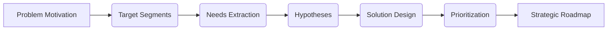

# Module 3: Ideation

## 3.1 Entrance Criteria

Before initiating the Ideation phase, the following must be set:

* **Validated Problem Definition**: Confirmed anchor from Discovery (Triangulation/HMW).
* **Research Synthesis**: Completed User Personas and Market Analysis.
* **Stakeholder Alignment**: Agreement that this problem is a business priority.

> [!IMPORTANT]
> Ideation is NOT about "features"; it's about finding the most effective "How" to solve the validated "Why" from Discovery.

## 3.2 Lead Roles & Squad

* **Primary Driver**: Product Manager (PM).
* **Support Squad**: Product Designer (UX/UI), Tech Lead (Feasibility), and Key Stakeholders.

> [!TIP]
> Include your Tech Lead in brainstorming. They often identify "technical shortcuts" that can deliver 80% of the value with 20% of the effort.

## 3.3 The Ideation Journey

From a validated problem to a committed roadmap:



## 3.4 Define Motivation (The "Why")

Establish the strategic justification. Every squad must answer:

* **What is the problem?** (The core friction).
* **Who is affected?** (Specific persona).
* **Why solve it now?** (The **Cost of Inaction**).
* **What is the value?** (Intended outcome: Revenue, Efficiency, or CX).

> [!WARNING]
> Identify the "Cost of Inaction." If we do nothing for 6 months, what is the impact on churn or revenue? This justifies your project's urgency.

## 3.5 Defining the Target User & JTBD

Narrow the focus to avoid "Swiss Army Knife" syndrome.

* **Segmentation**: Demographics, Psychographics, and Behavior.
* **JTBD**: The underlying goal a user "hires" your product to achieve.
* **Empathy Mapping**: What do they Say, Do, Think, and Feel?

> [!NOTE]
> **JTBD Format**: "As a [Persona], I want to [Action] so that [Outcome]." Focus on the *progress* the user wants to make, not the tool they use.

## 3.6 Prioritizing Target Segments

Choose the target for V1 using disciplined models:

* **Weighted Scoring**: Rank by Reach, Frequency, Urgency, and Impact.
* **Pareto (80/20)**: Focus on the 20% of users driving 80% of the volume.
* **Opportunity Scoring**: Importance + (Importance - Satisfaction) = Opportunity.

> [!TIP]
> Solve for the "Hardest Case" first. If you can fix the pain for your most demanding users, you'll likely delight the rest of the market.

## 3.7 Finding the Pain & Needs

Transform raw data into structured requirements.

* **Problem Hotspots**: Where do users quit or pause in the Journey Map?
* **The "Workaround" Audit**: Identify manual hacks (Excel, calls) users do because the product fails them. **Workarounds are the smoking gun of a major need.**
* **Root Cause**: Use "5 Whys" to get past surface complaints to the source.

## 3.8 Generating Product Hypotheses

Translate prioritized pain points into testable assumptions.

> [!IMPORTANT]
> **Hypothesis Format**: "We believe that **[Feature/Change]** for **[Persona]** will achieve **[Metric Impact]** because **[Behavioral Insight]**."

| Quality | Example                                                                                                      |
| ------- | ------------------------------------------------------------------------------------------------------------ |
| ❌ Bad   | "We should build a dashboard because they like data."                                                        |
| ✅ Good  | "Adding a 'Quick-Claim' button will reduce drop-offs by 15% because users find the 5-step form too tedious." |

## 3.9 Prioritize Solutions (Quantitative)

Use data-driven frameworks to decide what enters the roadmap.

### RICE Scoring

```mermaid
graph TD
    R(Reach) --> F[*]
    I(Impact) --> F
    C(Confidence) --> F
    F --> D[/]
    E(Effort) --> D
    D --> S{RICE SCORE}
```

### WSJF (Cost of Delay)
- **CoD** = (User Value + Time Criticality + Risk Reduction).
- **WSJF** = CoD / Job Size.

## 3.10 Categorical Prioritization (Qualitative)

For when you need stakeholder alignment over formulas.

* **MoSCoW**: Must-Have, Should-Have, Could-Have, Won't-Have.
* **Kano Model**: Basic (Must-be), Performance (Linear), and Delighters (Excitement).
* **Buy a Feature**: Stakeholders "spend" a limited budget on the items they value most.

> [!CAUTION]
> Avoid "Gut-Only" prioritization. If a feature has low evidence, build a small "Test Prototype" first to raise your Confidence Score.

## 3.11 The Strategic Roadmap

The roadmap is a communication tool, not a fixed Gantt chart.

| Horizon   | Focus                                    | Confidence |
| --------- | ---------------------------------------- | ---------- |
| **NOW**   | Committed & High Confidence (0-4 weeks). | 5/5        |
| **NEXT**  | Validated & High Clarity (1-3 months).   | 3-4/5      |
| **LATER** | Discovery & Future Vision (3+ months).   | 1-2/5      |

> [!IMPORTANT]
> **NOW** items must have a finalized PRD and Design. **LATER** items are directional "North Stars" subject to change.

## 3.12 KPI & Measurement

Define success across three dimensions:

1. **North Star Metric**: The highest-level indicator of core value.
2. **Leading Metrics**: Immediate signals of progress (e.g., clicks, conversion).
3. **Lagging Metrics**: Final business outcomes (e.g., Churn, Revenue).

## 3.13 Common Pitfalls

* **Solving for Everyone**: Resulting in a mediocre product for all and great for none.
* **Gut-Only Decisions**: Ignoring the "Evidence Meter."
* **Output over Outcome**: Measuring success by "number of features shipped" rather than "business impact."

## 3.14 Exit Criteria (The Gate)

* [ ] Target user and pain points are clearly defined.
* [ ] Solutions are prioritized via RICE or WSJF.
* [ ] **Now-Next-Later** Roadmap is signed-off.
* [ ] Measurable success metrics (North Star) are defined.
