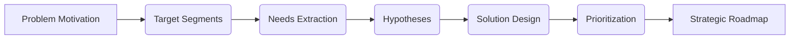

# Ideation Phase

## Entrance Criteria

Before initiating the Ideation phase, the following must be set:

::::present
- **Validated Problem Definition**: Confirmed via HMW workshops, data triangulation, or proof of pain.
- **Research Synthesis**: Completed User Personas and Market Analysis.
- **Stakeholder Alignment**: Agreement on the business priority of the problem space.

> [!IMPORTANT]
> Ideation is NOT about "features"; it's about finding the most effective "How" to solve the validated "Why" from Discovery.
::::

- **Validated Problem Definition**: Confirmed via HMW workshops, data triangulation, or proof of pain.
- **Research Synthesis**: Completed User Personas and Market Analysis.
- **Stakeholder Alignment**: Agreement on the business priority of the problem space.

> [!IMPORTANT]
> Ideation is NOT about "features"; it's about finding the most effective "How" to solve the validated "Why" from Discovery.

## Lead Roles & Squad

::::present
- **Primary Driver**: Product Manager (PM).
- **Support Squad**: Product Designer (UX/UI), Tech Lead (Feasibility), and Key Stakeholders.

> [!TIP]
> Include your Tech Lead in brainstorming. They often identify "technical shortcuts" that can deliver 80% of value with 20% effort.
::::

* **Primary Driver**: Product Manager (PM).
* **Support Squad**: Product Designer (UX/UI), Tech Lead (Feasibility), and Key Stakeholders.

> [!TIP]
> Include your Tech Lead in brainstorming. They often identify "technical shortcuts" that can deliver 80% of the value with 20% of the effort.

## The Ideation Journey

::::present

From a validated problem to a committed roadmap:

::::

From a validated problem to a committed roadmap:

## Define Motivation (The "Why")

::::present
Every squad must answer the core "Why":
- **What is the problem?** (The core friction).
- **Who is affected?** (Specific persona).
- **Why solve it now?** (The Cost of Inaction).
- **How to solve it?** High-level hypothesis of the solution approach.
- **What is the value?** (Revenue, Efficiency, or CX).

Understand the business situation with Deep-Dive Analysis
* **Contextual Background**: Internal data (funnels) and External trends (benchmarks).
* **Cost of Inaction**: Business impact (revenue loss, churn, tech debt) if we do nothing for 6 months.

> [!WARNING]
> Identify the **Cost of Inaction**. If we do nothing for 6 months, what is the impact? This justifies your project's urgency.
::::

Establish the strategic justification. Every squad must answer:

* **What is the problem?** (The core friction).
* **Who is affected?** (Specific persona).
* **Why solve it now?** (The **Cost of Inaction**).
* **How to solve it?** High-level hypothesis of the solution approach.
* **What is the value?** (Intended outcome: Revenue, Efficiency, or CX).

Understand the business situation with Deep-Dive Analysis
* **Contextual Background**: Internal data (funnels) and External trends (benchmarks).
* **Cost of Inaction**: Business impact (revenue loss, churn, tech debt) if we do nothing for 6 months.

> [!WARNING]
> Identify the "Cost of Inaction." If we do nothing for 6 months, what is the impact on churn or revenue? This justifies your project's urgency.

## Identifying Target Segments

::::present
Focus your effort using disciplined models:
- **Segmentation**: Demographics, Psychographics, Behavior.
- **Customer Profiling & JTBD**: What "progress" is the user trying to make?
- **Empathy Mapping**: Detailed analysis of Says, Does, Thinks, Feels, Pains, and Gains.
- **Journey Mapping (As-Is)**: Identifying "Moments of Truth" in the current experience.
- **Opportunity Scoring**: Importance vs. Satisfaction.

> [!NOTE]
> **JTBD Format**: "As a [Persona], I want to [Action] so that [Outcome]." Focus on the *progress*, not the tool.
::::

- **Segmentation**
  - **Demographics**: Age, gender, income, occupation.
  - **Psychographics**: Lifestyle, values, personality traits, and social status.
  - **Geography**: Specific regions, urban vs. rural, or climate-based logistics needs.
  - **Behavior**: Usage frequency (heavy vs. light), brand loyalty, and readiness to purchase.
- **Customer Profiling & JTBD**: 
  - Select primary and secondary personas. Document their Jobs to be Done" (JTBD)—the underlying goal a user is trying to "hire" your product to achieve.
- **Detailed Empathy Mapping**: Visualize the user's internal and external world to identify unspoken needs:
  - **Says & Does**: What are their explicit comments during research? What actions do they take in the current workflow?
  - **Thinks & Feels**: What are their internal anxieties? What do they value but don't explicitly say?
  - **Pains**: What are their fears, frustrations, and the obstacles standing in their way?
  - **Gains**: What are their "wants," their measures of success, and what would actually delight them?
- **Journey Mapping (As-Is)**: Identifying "Moments of Truth" in the current experience.
- **Opportunity Scoring**: Importance vs. Satisfaction.

> [!NOTE]
> **JTBD Format**: "As a [Persona], I want to [Action] so that [Outcome]." Focus on the *progress* the user wants to make, not the tool they use.

## Target Market Prioritization Frameworks

::::present
Choose the target for V1:
- **Weighted Scoring**: Reach, Frequency, Urgency, Impact.
- **Pareto Principle**: The 20% of users driving 80% of volume.
- **Opportunity Scoring**: Importance + max(Importance - Satisfaction, 0) = Opportunity.
- **Strategic Frameworks**: GE-McKinsey Matrix or Cost of Delay (CoD).
- **Hardest Case First**: Solve for the most demanding users first.

> [!TIP]
> If you can fix the pain for your most demanding users, you'll likely delight the rest of the market.
::::

Choose the target for V1 using disciplined models:

- **Weighted Scoring**
  - **Reach**: Total addressable volume of the segment.
  - **Frequency**: How often the user encounters the pain point.
  - **Urgency**: The immediate necessity of the solution.
  - **Impact**: Degree of value/improvement created for the user.
  - **Underserved**: Lack of quality alternatives or competitor presence.
- **Pareto Principle**: Identify the 20% of customer segments that generate 80% of total revenue or transaction volume.
- **Opportunity Scoring**
  - Opportunity = Importance + max(Importance - Satisfaction, 0).
  - Highest Priority: High importance + low satisfaction.
- **Strategic Frameworks**
  - **GE-McKinsey Matrix (3x3)**: Plot Industry Attractiveness vs. Business Strength to decide whether to Invest, Maintain, or Exit.
  - **Cost of Delay (CoD)**: Quantify the estimated revenue or savings lost per week the product remains unlaunched.
    - Cost of Delay (CoD) = (User-Business Value + Time Criticality + Risk Reduction/Opp Enablement).
- **Hardest Case First**: Solve for the most demanding users first.

> [!TIP]
> Solve for the "Hardest Case" first. If you can fix the pain for your most demanding users, you'll likely delight the rest of the market.

## Finding the Pain & Needs

::::present
### Techniques to Extract Needs
Transforming raw discovery data into structured requirements.

- **?[Pain Hotspots](Identifying steps in the user journey with the highest drop-off or negative sentiment.)**: Where do users quit or hesitate?
- **?[Workaround Audit](Manual hacks are the "smoking gun" of a major product gap. If users use Excel for it, they're desperate for a feature.)**: Manual hacks are the "smoking gun" of needs.
- **?[Root Cause (5 Whys)](Asking "why" 5 times to uncover the origin of a problem rather than just the symptom.)**: Dig past surface complaints to the source.
- **Goal vs. Reality**: Define the "Gap" between intent and friction.
::::

::::present
### The Needs Statement (JTBD)
Frame requirements by the **Outcome**, not the Feature.

**The Format:**
> "As a **[Persona]**, I need **[Requirement]** so that **[Outcome]**"

**Examples:**
- **E-commerce**: Item Value >Rp1M → Auto-Insurance.
- **SaaS**: Bulk Upload CSV → Zero manual effort.
::::

Transform raw discovery data into structured, actionable requirements. This ensures the solution is anchored in human needs rather than technical assumptions.

Identification & Extraction Techniques:
- **Finding "Pain Hotspots"**: Identify specific steps in the Journey Map where users most frequently quit, pause, or express high negative sentiment.
- **Connecting the Dots (Theme Sorting)**: Group similar feedback from interviews, support tickets, or logs. If 20 people mention a specific frustration, that is a "dot connected" into a requirement theme.
- **Goal vs. Reality (Gap Analysis)**: Explicitly define what the user is trying to achieve (Goal) vs. the current friction they face (Reality). The "gap" is the core requirement.
- **The "Workaround" Audit**: Identify manual things users do (e.g., using Excel, calling support, manual hacks) because the product fails them. Workarounds are the "smoking gun" for a major product need.
- **Root Cause (5 Whys)**: Ask "why" 5 times to get past surface complaints and find the actual source of the pain.

Drafting the Needs Statement: Formalize the unmet need into a "Job to be Done" format. This frames the requirement by the outcome rather than the feature.

* Format: "As a **User Persona**, I need **Functional/Emotional Requirement** so that **Expected Benefit/Outcome**"
* General Examples:
  * **E-commerce**: As a frequent shopper, I need to save my payment details securely so that I can complete my checkout process in one click.
  * **SaaS/Productivity**: As a project manager, I need a template library so that I can set up boards without starting from scratch

## Prioritizing the Problem

::::present
Stop jumping to solutions. Filter your needs through 5 dimensions.

- **Reach & Severity**: Impact volume vs. pain depth.
- **?[Strategic Mandate](Management requests are hypotheses until validated. Align them with business direction AND customer needs before building.)**: Leadership requests (The Validation Job).
- **?[The Evidence Meter](Confidence Score: High: 5/5 = Hard data/Interviews. Low: 1/5 = Gut feeling or single request. Low evidence requires a Prototype 'Test' first.)**: Data-backed (Low Risk) vs. Gut-feeling (High Risk).
- **Market Windows**: Seasonal shifts, regulations, and trends.
- **OKR Alignment**: Growth, Efficiency, or CX pillars.

> [!TIP]
> **Low Confidence = High Risk.** If your Evidence Meter is 1/5, build a lo-fi prototype to test the hypothesis before wasting engineering weeks.
::::

Before jumping to solutions, rank the identified needs. Use these five dimensions to balance data with business reality:

* **Reach & Severity**: How many people does it hurt, and how badly?
* **Strategic Mandate (Top-down Direction)**: Requests from leadership or management. The PM's Job: Validate the request, connect it to the business direction, and align it with customer needs before execution.
* **The Evidence Meter (Confidence Score)**:
  * **High (5/5)**: Proven by hard data, logs, and high-volume user interviews. (Low risk)
  * **Low (1/5)**: Based on a "Gut Feeling" or a single stakeholder request. (High risk—requires a small "test" build/prototype first).
* **Market Dynamics & Trends**: Identify if there is a "Market Window"—a seasonal shift, a new regulation, or a fast-moving trend (e.g., new payment standards) we must catch to remain relevant.
* **Business Impact & OKR Alignment**: Does solving this directly move the needle for our current company pillars (Growth, Efficiency, or CX)?

## Generating Product Hypotheses

::::present
Translate pain into testable assumptions:

> [!IMPORTANT]
> **Hypothesis Format**: "We believe that **[Feature]** for **[Persona]** will achieve **[Metric Impact]** because **[Behavioral Insight]**."

| **Type** | **Example** | **Why it's Good/Bad** |
| :--- | :--- | :--- |
| **Bad** | "We should build a new dashboard for Biza users because they like data." | Too vague. No target metric, no clear reason, and assumes the solution (dashboard) is the answer without a 'why'. |
| **Good** | "We believe that adding a 'Quick-Claim' button to the shipment history for Anteraja Pro users will reduce the 'File a Claim' drop-off rate by 15% because high-volume users value speed and find the current 5-step form too tedious." | Crystal Clear. It defines the persona, the action, the exact metric to move, and the behavioral insight. |
| **Bad** | "We will improve Shipping Insurance sales by making the UI look modern." | 'Modern' is subjective. There is no measurable hypothesis or evidence-based reasoning. |
| **Good** | "We believe that defaulting the 'Basic Insurance' toggle to 'ON' during the checkout for retail users will increase insurance TPV by 10% because Discovery showed users aren't avoiding insurance, they are simply overlooking it." | Testable. It identifies a specific friction point (overlooking) and predicts a business outcome. |
::::

Translate prioritized pain points into testable assumptions.

> [!IMPORTANT]
> **Hypothesis Format**: "We believe that **[Feature/Change]** for **[Persona]** will achieve **[Metric Impact]** because **[Behavioral Insight]**."

| **Type** | **Example** | **Why it's Good/Bad** |
| :--- | :--- | :--- |
| **Bad** | "We should build a new dashboard for Biza users because they like data." | Too vague. No target metric, no clear reason, and assumes the solution (dashboard) is the answer without a 'why'. |
| **Good** | "We believe that adding a 'Quick-Claim' button to the shipment history for Anteraja Pro users will reduce the 'File a Claim' drop-off rate by 15% because high-volume users value speed and find the current 5-step form too tedious." | Crystal Clear. It defines the persona, the action, the exact metric to move, and the behavioral insight. |
| **Bad** | "We will improve Shipping Insurance sales by making the UI look modern." | 'Modern' is subjective. There is no measurable hypothesis or evidence-based reasoning. |
| **Good** | "We believe that defaulting the 'Basic Insurance' toggle to 'ON' during the checkout for retail users will increase insurance TPV by 10% because Discovery showed users aren't avoiding insurance, they are simply overlooking it." | Testable. It identifies a specific friction point (overlooking) and predicts a business outcome. |

## Explore Solutions (Divergent Thinking)

::::present
Moving from "The Best Hypothesis" to "The Best Implementation."

- **HMW Reframing**: Convert problems into "How Might We?" questions.
- **?[Crazy 8's Sketching](A design ritual where participants sketch 8 distinct UI solutions in 1 minute per sketch. Goal: Quantity over quality to find non-obvious ideas.)**: Sketch 8 ideas in 8 minutes.
- **?[Lightning Decision Jam (LDJ)](A structured, silent workshop format to identify solutions and vote on actions without circular discussions.)**: Silent ideation and democratization of voting.
- **Storyboarding**: Mapping the journey in 3-6 visual panels.
- **Feasibility (Tech-In)**: Early engineering sanity check.

> [!TIP]
> **Quantity leads to Quality.** Don't settle for your first idea. The obvious solution is usually the one your competitors already have.
::::

Transform the prioritized hypotheses into actionable product concepts. This step focuses on divergent thinking to find the best "How."

* **HMW (How Might We) Reframing**: Convert each prioritized problem into a question (e.g., "HMW make the checkout process feel instantaneous?").
* **Crazy 8's Sketching**: A core design ritual where participants sketch 8 distinct UI/UX solutions in 8 minutes. The goal is quantity and pushing past the "obvious" first idea.
* **Lightning Decision Jam (LDJ)**: A structured, silent workshop to identify solution concepts, vote on the best ideas, and decide on action items without circular discussions.
* **Solution Storyboarding**: Visualize the solution in a sequence of 3-6 panels showing the user's interaction from trigger to resolution.
* **Feasibility Check (Tech-In)**: Brief consultation with Engineering to flag "High-Complexity" solutions before they enter deep prioritization.

## Prioritize Solutions (Quantitative)

::::present
### Prioritize Solutions (Quantitative)
Decide what enters the roadmap using objective data.

:::col
#### 1. RICE (Impact Focused): Higher Score = Higher Priority
**Formula**: `(Reach × Impact × Confidence) / Effort`
* **Reach**: Customers per quarter.
* **Impact**: 3 (Massive) to 0.25 (Minimal).
* **Confidence**: 100% to 50%.
* **Effort**: Person-months.

> [!TIP]
> Use **RICE** for individual feature comparison within a single product.
:::
:::col
#### 2. WSJF (Time Focused): Higher Score = Higher Priority
**Formula**: `(User Value + Criticality + RR|OE) / Job Size`

* **User Value**: Business impact.
* **Criticality**: Deadlines/Value decay.
* **RR / OE**: Risk/Opportunity.
* **Job Size**: Fibonacci (1, 2, 3, 5, 8, 13, 21).

> [!TIP]
> Use **WSJF** for high-level portfolio/epic prioritization where timing is critical.
:::
::::

Quantitative frameworks remove emotion from the roadmap and provide a clear "ROI" for every feature.

### RICE Scoring: The Feature Filter

Best used when comparing multiple features for a single product. It balances broad reach against technical cost.

> [!NOTE]
> **RICE = (Reach × Impact × Confidence) / Effort**

| Component | Standard Scale used in RICE |
| :--- | :--- |
| **Reach** | Number of users affected in a specific timeframe (e.g., 500 users/mo). |
| **Impact** | **3** (Massive), **2** (High), **1** (Medium), **0.5** (Low), **0.25** (Minimal). |
| **Confidence** | **100%** (High), **80%** (Medium), **50%** (Low). Below 50% is a "Moonshot." |
| **Effort** | Estimated "Person-Months" (e.g., 1 PM, 2 Devs = 3 points/mo). |

* **Rule of Thumb**: Higher Score = Higher Priority.
* **Example**: Automated Claims Submission Portal. Reach (2,000) x Impact (3) x Confidence (0.8) / Effort (3 months) = 1,600.

---

### WSJF: Weighted Shortest Job First

Best used for Portfolio management or when "Cost of Delay" (CoD) is the primary concern. It favors smaller, high-value jobs that deliver value quickly.

> [!NOTE]
> **WSJF = Cost of Delay / Job Size**
> 
> **Cost of Delay (CoD)** = (User-Business Value + Time Criticality + Risk Reduction/Opp Enablement).

| Component | Typical Scale (Fibonacci) |
| :--- | :--- |
| **User-Business Value** | Relative value to the user or business (1, 2, 3, 5, 8, 13, 21). |
| **Time Criticality** | How much the value decays if we wait? (1, 2, 3, 5, 8, 13, 21). |
| **RR / OE Value** | Does this reduce risk or enable future opportunities? (1, 2, 3, 5, 8, 13, 21). |
| **Job Size** | Relative technical effort/complexity (1, 2, 3, 5, 8, 13, 21). |

* **Rule of Thumb**: Higher Score = Higher Priority.
* **Example**: Automated Claims Submission Portal. User-Business Value (21) x Time Criticality (3) x RR / OE Value (2) x Job Size (5) = 630.

#### When to use which?
* **Use RICE when**: You need to justify a feature to a broad set of stakeholders and want to prove its reach across the user base.
* **Use WSJF when**: You are in a fast-moving market where "missing the window" (Time Criticality) is more dangerous than missing a few users.

## Categorical Prioritization (Qualitative)

::::present
Stakesholder alignment models:
- **MoSCoW**: Must, Should, Could, Won't.
- **Kano Model**: Basics, Performance, Delighters.
- **Buy a Feature**: Limited budget exercise for team alignment.

> [!CAUTION]
> Avoid "Gut-Only" prioritization. If evidence is low, build a small "Test Prototype" first.
::::

For when you need stakeholder alignment over formulas.

* **MoSCoW Method**
  * **Must-Have**: Non-negotiable for launch.
  * **Should-Have**: Important but not vital for V1.
  * **Could-Have**: Nice-to-have enhancements.
  * **Won't-Have**: Agreed out-of-scope for now.
* **Kano Model**:
  * **Basic (Must-be)**: Taken for granted; absence causes high dissatisfaction.
  * **Performance (Linear)**: Satisfaction increases with more provision.
  * **Delighters (Excitement)**: Unexpected features that create high delight.

> [!CAUTION]
> Avoid "Gut-Only" prioritization. If a feature has low evidence, build a small "Test Prototype" first to raise your Confidence Score.

## Visual & Collaborative Prioritization

::::present
### Visual & Collaborative Frameworks
Aligning stakeholders through spatial and gamified prioritization.

:::col
#### The 2x2 Matrix
* **?[Quick Wins](High Value, Low Effort. These build momentum and deliver immediate business value with minimal engineering burden.)**: High Value + Low Effort.
* **?[Strategic Initiatives](High Value, High Effort. These are the mission-critical "Big Bets" that move the North Star metrics.)**: High Value + High Effort.
* **?[Fill-ins](Low Value, Low Effort. Low priority tasks to be done only when the squad has extra capacity.)**: Low Value + Low Effort.
* **Thankless Tasks**: Discard immediately.
:::
:::col
#### Buy a Feature
A gamification ritual to uncover the *true* priorities of your stakeholders.

* **Limited Budget**: Participants are given fixed "cash" to spend.
* **Forcing Trade-offs**: They must choose between many competing ideas.
* **Pooling Resources**: Encourages stakeholders to negotiate and co-invest.
:::
::::

* **Value vs. Effort Matrix (2x2)**
  * **Quick Wins**: High Value, Low Effort.
  * **Strategic Initiatives**: High Value, High Effort.
  * **Fill-ins**: Low Value, Low Effort.
  * **Thankless Tasks**: Low Value, High Effort (Discard).
* **Buy a Feature**: Stakeholders use a limited virtual budget to "buy" the features they value most.

## The Strategic Roadmap

::::present
A communication tool, not a Gantt chart:

| Horizon | Focus | Confidence |
| :--- | :--- | :--- |
| **NOW** | Committed & Finalized (0-4w) | 5/5 |
| **NEXT** | Validated & High Clarity (1-3m) | 3-4/5 |
| **LATER** | Discovery & Future Vision (3m+) | 1-2/5 |

> [!IMPORTANT]
> **NOW** items must have a finalized PRD and Design. **LATER** items are directional.
::::

The roadmap is the strategic communication tool that balances high-confidence execution with low-confidence exploration.

* **NOW (Committed & High Confidence)**:
  * **Timeline**: The current sprint or the immediate next cycle (0–4 weeks).
  * **Criteria**: Features in this bucket have passed Step 8 (Prioritization), Step 3 (Technical Discovery), and have a finalized PRD/Design.
  * **Confidence**: 5/5 on the Evidence Meter. Engineering capacity is explicitly allocated.
  * **Commitment**: Firm delivery dates or sprint commitments.
* **NEXT (Validated & High Clarity)**:
  * **Timeline**: The upcoming 1–3 months.
  * **Criteria**: These are validated problems/solutions that are currently being refined or waiting for "Now" items to finish.
  * **Confidence**: 3/5 to 4/5 on the Evidence Meter. The problem is validated, and the solution concept is tested, but technical debt or resource constraints prevent immediate execution.
  * **Commitment**: Strategic intent to build; subject to adjustment based on "Now" outcomes.
* **LATER (Discovery & Future Vision)**:
  * **Timeline**: 3+ months and beyond.
  * **Criteria**: These are high-level themes, ambitious hypotheses, or problems identified in Step 4 that require further Discovery (Module 2).
  * **Confidence**: 1/5 to 2/5 on the Evidence Meter (Gut Feelings, Trends, or "Market Windows").
  * **Commitment**: No firm commitment. These items act as a directional "North Star" for the product’s evolution.

> [!IMPORTANT]
> **NOW** items must have a finalized PRD and Design. **LATER** items are directional "North Stars" subject to change.

## KPI & Measurement

::::present
* **North Star Metric**: Highest indicator of core value.
* **Key metrics**: Indicators of progress toward the North Star.
::::

* **North Star Metric**: The highest-level metric measuring core value delivered to the customer.
* **Key metrics**: Indicators of progress toward the North Star.

## Common Pitfalls

::::present
- **Solving for Everyone**: Resulting in a mediocre product for all.
- **Gut-Only Decisions**: Ignoring the "Evidence Meter."
- **Output over Outcome**: Shipping features vs. shipping impact.
::::

* **Solving for Everyone**: Resulting in a mediocre product for all and great for none.
* **Gut-Only Decisions**: Ignoring the "Evidence Meter."
* **Output over Outcome**: Measuring success by "number of features shipped" rather than "business impact."

## Rituals & Syncs

::::present
The heartbeat and tangible outcomes of the Ideation phase.

- **Ideation Workshop**: Cross-functional session to converge on solution ideas.
- **Roadmap Review**: Monthly alignment with leaders on prioritization logic.

::::

* **Ideation Workshop**: Cross-functional session to generate and converge on solution ideas.
* **Roadmap Review**: Monthly alignment with leadership to review prioritization logic.

## Deliverables

::::present
The heartbeat and tangible outcomes of the Ideation phase.

- **Product Strategy Document**: The vision, segments, and strategic approach.
- **Prioritized Backlog**: A ranked list of validated solutions.
- **Product Roadmap**: A phased execution plan shared with the organization.
::::

* **Product Strategy Document**: The vision, segments, and strategic approach.
* **Prioritized Backlog**: A ranked list of validated solutions.
* **Product Roadmap**: A phased execution plan shared with the organization.

## Common Pitfalls (Anti-patterns)

::::present
### Ideation Pitfalls
Red flags that signal "Process Drift" or poor strategic thinking.

- **?[Solving for Everyone](Trying to build a product that pleases every segment simultaneously. Result: A mediocre product for all and great for none.)**: The "Averaging" Trap.
- **?[Gut-Only Prioritization](Using 'Gut Feeling' without attempting to move it up the Evidence Meter via data or research.)**: Ignoring the Evidence Meter.
- **?[Ignoring the Mandate](Failing to validate or properly deconstruct a top-down management request before execution.)**: Blind Execution of top-down tasks.

> [!CAUTION]
> If you find yourself building a feature just because "the competitor has it," you have fallen into the most common pitfall of all. **Validate if your target segment actually shares that pain.**
::::

* **Solving for Everyone**: Resulting in a mediocre product for all and great for none.
* **Gut-Only Prioritization**: Using "Gut Feeling" without attempting to move it up the Evidence Meter.
* **Ignoring the Mandate**: Failing to validate or properly strategize a top-down request.

## Exit Criteria (The Gate)

::::present
* **Target user and pain points** are clearly defined.
* **Solutions** are prioritized via RICE or WSJF.
* **Now-Next-Later** Roadmap is signed-off.
* **Measurable success metrics** (North Star) are defined.
::::

* **Target user and pain points** are clearly defined.
* **Solutions** are prioritized via RICE or WSJF.
* **Now-Next-Later** Roadmap is signed-off.
* **Measurable success metrics** (North Star) are defined.
