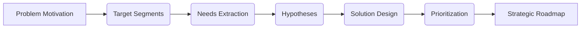

# Module 3: Ideation

## 3.1 Entrance Criteria

Before initiating the Ideation phase, the following must be set:

::::present
- **Validated Problem Definition**: Confirmed anchor from Discovery (Triangulation/HMW).
- **Research Synthesis**: Completed User Personas and Market Analysis.
- **Stakeholder Alignment**: Agreement that this problem is a business priority.

> [!IMPORTANT]
> Ideation is NOT about "features"; it's about finding the most effective "How" to solve the validated "Why" from Discovery.
::::

* **Validated Problem Definition**: Confirmed anchor from Discovery (Triangulation/HMW).
* **Research Synthesis**: Completed User Personas and Market Analysis.
* **Stakeholder Alignment**: Agreement that this problem is a business priority.

> [!IMPORTANT]
> Ideation is NOT about "features"; it's about finding the most effective "How" to solve the validated "Why" from Discovery.

## 3.2 Lead Roles & Squad

::::present
- **Primary Driver**: Product Manager (PM).
- **Support Squad**: Product Designer (UX/UI), Tech Lead (Feasibility), and Key Stakeholders.

> [!TIP]
> Include your Tech Lead in brainstorming. They often identify "technical shortcuts" that can deliver 80% of value with 20% effort.
::::

* **Primary Driver**: Product Manager (PM).
* **Support Squad**: Product Designer (UX/UI), Tech Lead (Feasibility), and Key Stakeholders.

> [!TIP]
> Include your Tech Lead in brainstorming. They often identify "technical shortcuts" that can deliver 80% of the value with 20% of the effort.

## 3.3 The Ideation Journey

::::present
[PDLC_MAP]

From a validated problem to a committed roadmap:

::::

From a validated problem to a committed roadmap:

## 3.4 Define Motivation (The "Why")

::::present
Every squad must answer the core "Why":
- **What is the problem?** (The core friction).
- **Who is affected?** (Specific persona).
- **Why solve it now?** (The Cost of Inaction).
- **What is the value?** (Revenue, Efficiency, or CX).

> [!WARNING]
> Identify the **Cost of Inaction**. If we do nothing for 6 months, what is the impact? This justifies your project's urgency.
::::

Establish the strategic justification. Every squad must answer:

* **What is the problem?** (The core friction).
* **Who is affected?** (Specific persona).
* **Why solve it now?** (The **Cost of Inaction**).
* **What is the value?** (Intended outcome: Revenue, Efficiency, or CX).

> [!WARNING]
> Identify the "Cost of Inaction." If we do nothing for 6 months, what is the impact on churn or revenue? This justifies your project's urgency.

## 3.5 Identifying Target Segments

::::present
Focus your effort using disciplined models:
- **Segmentation**: Demographics, Psychographics, Behavior.
- **JTBD**: What "progress" is the user trying to make?
- **Opportunity Scoring**: Importance vs. Satisfaction.

> [!NOTE]
> **JTBD Format**: "As a [Persona], I want to [Action] so that [Outcome]." Focus on the *progress*, not the tool.
::::

* **Segmentation**: Demographics, Psychographics, and Behavior.
* **JTBD**: The underlying goal a user "hires" your product to achieve.
* **Empathy Mapping**: What do they Say, Do, Think, and Feel?

> [!NOTE]
> **JTBD Format**: "As a [Persona], I want to [Action] so that [Outcome]." Focus on the *progress* the user wants to make, not the tool they use.

## 3.6 Prioritization Frameworks

::::present
Choose the target for V1:
- **Weighted Scoring**: Reach, Frequency, Urgency, Impact.
- **Pareto Principle**: The 20% of users driving 80% of volume.
- **Hardest Case First**: Solve for the most demanding users first.

> [!TIP]
> If you can fix the pain for your most demanding users, you'll likely delight the rest of the market.
::::

Choose the target for V1 using disciplined models:

* **Weighted Scoring**: Rank by Reach, Frequency, Urgency, and Impact.
* **Pareto (80/20)**: Focus on the 20% of users driving 80% of the volume.
* **Opportunity Scoring**: Importance + (Importance - Satisfaction) = Opportunity.

> [!TIP]
> Solve for the "Hardest Case" first. If you can fix the pain for your most demanding users, you'll likely delight the rest of the market.

## 3.7 Finding the Pain & Roots

::::present
Transform raw data into requirements:
- **The Workaround Audit**: Manual hacks are the "smoking gun" of a major need.
- **Problem Hotspots**: Where do users pause or quit?
- **Root Cause Analysis**: Use "5 Whys" to dig deeper.
::::

Transform raw data into structured requirements.

* **Problem Hotspots**: Where do users quit or pause in the Journey Map?
* **The "Workaround" Audit**: Identify manual hacks (Excel, calls) users do because the product fails them. **Workarounds are the smoking gun of a major need.**
* **Root Cause**: Use "5 Whys" to get past surface complaints to the source.

## 3.8 Generating Product Hypotheses

::::present
Translate pain into testable assumptions:

> [!IMPORTANT]
> **Hypothesis Format**: "We believe that [Feature] for [Persona] will achieve [Metric Impact] because [Behavioral Insight]."

| Quality | Example |
| :--- | :--- |
| ✅ Good | "Adding a 'Quick-Claim' button will reduce drop-offs by 15%." |
| ❌ Bad | "We should build a dashboard because they like data." |
::::

Translate prioritized pain points into testable assumptions.

> [!IMPORTANT]
> **Hypothesis Format**: "We believe that **[Feature/Change]** for **[Persona]** will achieve **[Metric Impact]** because **[Behavioral Insight]**."

| Quality | Example                                                                                                      |
| ------- | ------------------------------------------------------------------------------------------------------------ |
| ❌ Bad   | "We should build a dashboard because they like data."                                                        |
| ✅ Good  | "Adding a 'Quick-Claim' button will reduce drop-offs by 15% because users find the 5-step form too tedious." |

## 3.9 Prioritize Solutions (Quantitative)

::::present
Decide what enters the roadmap using objective data.

:::cols
:::col
### 1. RICE (Impact Focused)
**Formula**: `(Reach × Impact × Confidence) / Effort`
* **Reach**: Customers per quarter.
* **Impact**: 3 (Massive) to 0.25 (Minimal).
* **Confidence**: 100% to 50%.
* **Effort**: Person-months.

> [!TIP]
> Use **RICE** for individual feature comparison within a single product.
:::col
### 2. WSJF (Time Focused)
**Formula**: `(User Value + Criticality + RR|OE) / Job Size`

* **User Value**: Business impact.
* **Criticality**: Deadlines/Value decay.
* **RR / OE**: Risk/Opportunity.
* **Job Size**: Fibonacci (1, 2, 3, 5, 8...).

> [!TIP]
> Use **WSJF** for high-level portfolio/epic prioritization where timing is critical.
:::
:::
::::

Quantitative frameworks remove emotion from the roadmap and provide a clear "ROI" for every feature.

### RICE Scoring: The Feature Filter

Best used when comparing multiple features for a single product. It balances broad reach against technical cost.

> [!NOTE]
> **RICE = (Reach × Impact × Confidence) / Effort**

| Component | Standard Scale used in RICE |
| :--- | :--- |
| **Reach** | Number of users affected in a specific timeframe (e.g., 500 users/mo). |
| **Impact** | **3** (Massive), **2** (High), **1** (Medium), **0.5** (Low), **0.25** (Minimal). |
| **Confidence** | **100%** (High), **80%** (Medium), **50%** (Low). Below 50% is a "Moonshot." |
| **Effort** | Estimated "Person-Months" (e.g., 1 PM, 2 Devs = 3 points/mo). |

---

### WSJF: Weighted Shortest Job First

Best used for Portfolio management or when "Cost of Delay" (CoD) is the primary concern. It favors smaller, high-value jobs that deliver value quickly.

> [!NOTE]
> **WSJF = Cost of Delay / Job Size**
> 
> **Cost of Delay (CoD)** = (User-Business Value + Time Criticality + Risk Reduction/Opp Enablement).

| Component | Typical Scale (Fibonacci) |
| :--- | :--- |
| **User-Business Value** | Relative value to the user or business (1, 2, 3, 5, 8, 13, 20). |
| **Time Criticality** | How much the value decays if we wait? (1, 2, 3, 5, 8, 13, 20). |
| **RR / OE Value** | Does this reduce risk or enable future opportunities? (1, 2, 3, 5, 8, 13, 20). |
| **Job Size** | Relative technical effort/complexity (1, 2, 3, 5, 8, 13, 20). |

#### When to use which?
* **Use RICE when**: You need to justify a feature to a broad set of stakeholders and want to prove its reach across the user base.
* **Use WSJF when**: You are in a fast-moving market where "missing the window" (Time Criticality) is more dangerous than missing a few users.

## 3.10 Categorical Prioritization (Qualitative)

::::present
Stakesholder alignment models:
- **MoSCoW**: Must, Should, Could, Won't.
- **Kano Model**: Basics, Performance, Delighters.
- **Buy a Feature**: Limited budget exercise for team alignment.

> [!CAUTION]
> Avoid "Gut-Only" prioritization. If evidence is low, build a small "Test Prototype" first.
::::

For when you need stakeholder alignment over formulas.

* **MoSCoW**: Must-Have, Should-Have, Could-Have, Won't-Have.
* **Kano Model**: Basic (Must-be), Performance (Linear), and Delighters (Excitement).
* **Buy a Feature**: Stakeholders "spend" a limited budget on the items they value most.

> [!CAUTION]
> Avoid "Gut-Only" prioritization. If a feature has low evidence, build a small "Test Prototype" first to raise your Confidence Score.

## 3.11 The Strategic Roadmap

::::present
A communication tool, not a Gantt chart:

| Horizon | Focus | Confidence |
| :--- | :--- | :--- |
| **NOW** | Committed & Finalized (0-4w) | 5/5 |
| **NEXT** | Validated & High Clarity (1-3m) | 3-4/5 |
| **LATER** | Discovery & Future Vision (3m+) | 1-2/5 |

> [!IMPORTANT]
> **NOW** items must have a finalized PRD and Design. **LATER** items are directional.
::::

The roadmap is a communication tool, not a fixed Gantt chart.

| Horizon   | Focus                                    | Confidence |
| --------- | ---------------------------------------- | ---------- |
| **NOW**   | Committed & High Confidence (0-4 weeks). | 5/5        |
| **NEXT**  | Validated & High Clarity (1-3 months).   | 3-4/5      |
| **LATER** | Discovery & Future Vision (3+ months).   | 1-2/5      |

> [!IMPORTANT]
> **NOW** items must have a finalized PRD and Design. **LATER** items are directional "North Stars" subject to change.

## 3.12 KPI & Measurement

::::present
Success across three dimensions:
1. **North Star Metric**: Highest indicator of core value.
2. **Leading Metrics**: Immediate signals (clicks, conversion).
3. **Lagging Metrics**: Final business outcomes (Churn, Revenue).
::::

Define success across three dimensions:

1. **North Star Metric**: The highest-level indicator of core value.
2. **Leading Metrics**: Immediate signals of progress (e.g., clicks, conversion).
3. **Lagging Metrics**: Final business outcomes (e.g., Churn, Revenue).

## 3.13 Common Pitfalls

::::present
- **Solving for Everyone**: Resulting in a mediocre product for all.
- **Gut-Only Decisions**: Ignoring the "Evidence Meter."
- **Output over Outcome**: Shipping features vs. shipping impact.
::::

* **Solving for Everyone**: Resulting in a mediocre product for all and great for none.
* **Gut-Only Decisions**: Ignoring the "Evidence Meter."
* **Output over Outcome**: Measuring success by "number of features shipped" rather than "business impact."

## 3.14 Exit Criteria (The Gate)

::::present
✅ Target user and pain points clearly defined.
✅ Solutions prioritized via RICE/WSJF.
✅ Now-Next-Later Roadmap signed-off.
✅ North Star success metrics defined.
::::

* Target user and pain points are clearly defined.
* Solutions are prioritized via RICE or WSJF.
* **Now-Next-Later** Roadmap is signed-off.
* Measurable success metrics (North Star) are defined.
