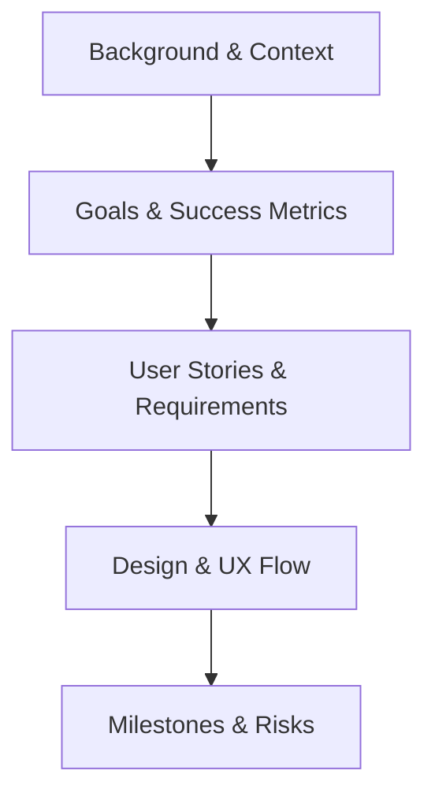

# PRD Masterclass

## 1. What exactly is a PRD?
A **Product Requirement Document (PRD)** is the single source of truth for a specific feature or product. It bridges the gap between a high-level vision and technical execution.

> [!NOTE]
> Think of it as a **contract** between Product, Design, and Engineering. It defines **WHAT** we are building and **WHY**, leaving the **HOW** to the engineers.

---

## 2. The Purpose: Why Bother?
Why not just send a Slack message or a Jira ticket?
- **Alignment**: Ensures everyone is rowing in the same direction.
- **Clarity**: Uncovers hidden complexities before a single line of code is written.
- **History**: Serves as documentation for why decisions were made.

> [!TIP]
> A great PRD doesn't just list features; it tells a **story** about a user's problem and how we solve it.

---

## 3. The Anatomy of a Winning PRD
While templates vary, every elite PRD follows this logical flow:

---

## 4. Section 1: The "Why" (Context & Goals)
Don't skip the "Background." Engineers are more motivated when they understand the impact.

- **Problem Statement**: What is the "pain" we are killing?
- **Hypothesis**: "If we build [X], then [Y] will happen, evidenced by [Z]."

> [!IMPORTANT]
> **Pro-Tip**: Use real user quotes or data points here to ground the feature in reality.

---

## 5. Section 2: The "What" (Requirements)
This is where the magic (and the detail) happens.

- **User Stories**: Functional requirements from the user's perspective.
- **Acceptance Criteria**: The "Definition of Done."

#### Example:
*As a user, I want to filter search results by date so that I can find recent content faster.*

---

## 6. Section 3: Scope & Constraints
Defining what you **AREN'T** building is just as important as what you are.

- **In-Scope**: The MVP features.
- **Out-of-Scope**: Future iterations or "Nice-to-haves."

> [!WARNING]
> **Trap**: "Scope Creep" happens when you aren't explicit about what is *Out-of-Scope*.

---

## 7. Section 4: Success Metrics (How we win)
How do we know if we succeeded?

- **Primary Metric**: The "North Star" for this feature (e.g., Conversion Rate).
- **Secondary Metrics**: Guardrail metrics (e.g., Page Load Time).

---

## 8. The Standard Template: Your PRD Passport
Our standard [PRD Template](file:///Users/christianhadianto/Documents/TechSmith/The%20Modern%20PM%20Playbook/material/2.%20prd-document/prd-template.md) is designed for speed and clarity.

- **Metadata**: Target release, status, and owners. (Always keep this updated!)
- **Document Versioning**: Crucial for large teams to track "who changed what."
- **Research Section**: Where you prove your hypothesis with desk studies and user interviews.

> [!TIP]
> **Pro-Tip**: Use the "Classification" field (Confidential vs Public) to ensure sensitive business logic isn't shared with the wrong audience.

---

## 9. Case Study: YouTube StudySpace (The "Why")
Let's look at a real example: [YouTube StudySpace](file:///Users/christianhadianto/Documents/TechSmith/The%20Modern%20PM%20Playbook/material/2.%20prd-document/prd-example-youtube-studyspace.md).

- **The Problem**: Educational content is booming, but retention is low.
- **The Persona**: "Mana, a 19-year-old student" who struggles to organize notes.
- **The Hypothesis**: Integrating **Gemini 2.0** will increase retention by 40%.

> [!IMPORTANT]
> A specific persona like "Mana" helps engineers visualize exactly who they are coding for, making technical trade-offs easier.

---

## 10. Scope Management (Case Study)
How StudySpace stays focused:

- **In-Scope ✅**: Real-time AI notes, Split-screen view, Progress dashboard.
- **Out-of-Scope ❌**: Live tutoring, Offline learning, LMS functionality.

> [!WARNING]
> By explicitly excluding "Full LMS functionality," the team avoided building features that would have delayed the Q3 2025 launch.

---

## 11. Validation & Metrics
How we measure "The Win":

| Metric           | Target | Result (Beta)    |
| ---------------- | ------ | ---------------- |
| Watch Time       | +30%   | +28%             |
| Quiz Performance | +40%   | +35%             |
| Response Time    | < 2s   | 2.8s (Needs Fix) |

- **Learning**: The "Response Time" failure became the #1 priority for the engineering team post-validation.

---

## 12. 💡 Masterclass Tips & Tricks
Elevate your PRDs from "Good" to "Vibe Architect" level:

1. **Be Visual**: Use flowcharts (Mermaid!), wireframes, and screenshots.
2. **The 3-Minute Rule**: A stakeholder should understand the "Why" and "What" in under 3 minutes of skimming.
3. **Collaboration over Dictation**: Tag engineers and designers early! A PRD is a living document.
4. **Assume Nothing**: Define your terms in a **Glossary**. What does "active user" actually mean for this project?

---

## 13. Conclusion & Next Steps
A PRD is only successful if it leads to a successful launch. 

- Keep it updated.
- Use it as the guide for your QA.
- Refer back to it during the Post-Mortem.

---

## Knowledge Check!

**Question 1**: In the YouTube StudySpace example, why was "Live Tutoring" marked as Out-of-Scope?
- A) Because users didn't want it.
- B) To maintain focus and prevent building a full Learning Management System (LMS).
- C) Because Gemini 2.0 can't handle live tutors.

(Correct: B)

**Question 2**: Which section of the PRD template is used to track changes over time across different authors?
- A) Metadata
- B) Document Version
- C) Appendix

(Correct: B)

**Question 3**: What was the primary motivation for the "Mana" persona in the case study?
- A) To show off demographic research.
- B) To humanize the problem of information retention for the development team.
- C) To meet marketing requirements.

(Correct: B)
